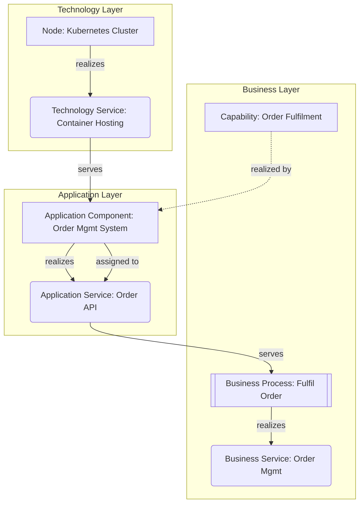

# ArchiMate 3.x

ArchiMate (The Open Group) is the standard language for **enterprise** architecture — it
models how business, applications, and technology fit together, across many systems. Where
C4 zooms into one system, ArchiMate zooms out to the whole organization.

## Table of contents
1. The layers & aspects (the framework grid)
2. Core elements by layer (the catalog you'll actually use)
3. Relationships (the hard part — get these right)
4. Viewpoints (which diagram for which question)
5. Rendering ArchiMate as code (Mermaid/PlantUML) & the Archi tool
6. Common mistakes

## 1. The layers & aspects

ArchiMate organizes elements into **layers** (rows) crossed with **aspects** (columns).

Layers (top to bottom):
- **Motivation** — *why*: stakeholders, drivers, goals, requirements, principles.
- **Strategy** — resources, capabilities, courses of action.
- **Business** — actors, roles, processes, functions, services, products.
- **Application** — application components, application services, data objects.
- **Technology** — nodes, devices, system software, networks, artifacts.
- **(Physical)** — equipment, facilities, materials (for IoT/manufacturing).
- **Implementation & Migration** — work packages, deliverables, plateaus, gaps.

Aspects (how to read across):
- **Active structure** (who/what acts — actor, component, node)
- **Behavior** (what happens — process, function, service)
- **Passive structure** (what's acted on — data object, artifact, business object)

Each layer typically has an active-structure element, a behavior element, and a service it
exposes "downward". The recurring pattern: a **service** abstracts behavior and is what the
layer above consumes. This *service-orientation between layers* is the heart of ArchiMate.

## 2. Core elements by layer

You don't need all 50+ elements. These cover the vast majority of real models:

**Motivation:** Stakeholder, Driver, Assessment, Goal, Outcome, Principle, Requirement,
Constraint.

**Strategy:** Resource, Capability, Course of Action, Value Stream.

**Business:** Business Actor, Business Role, Business Collaboration, Business Process,
Business Function, Business Service, Business Object, Product, Contract.

**Application:** Application Component, Application Collaboration, Application Function,
Application Service, Application Interface, Data Object.

**Technology:** Node, Device, System Software, Technology Service, Artifact,
Communication Network, Path.

**Implementation & Migration:** Work Package, Deliverable, Implementation Event, Plateau,
Gap.

Notation cues: layers are colour-coded by convention — **Motivation = purple, Business =
yellow, Application = blue, Technology = green, Strategy = orange, Implementation = pink**.
Rounded rectangles with a small glyph in the top-right denote the element type.

## 3. Relationships

ArchiMate's precision lives in its relationship types. Using the wrong one is the most
common modeling error. The main ones, strongest (structural) to weakest:

**Structural:**
- **Composition** (filled diamond) — whole/part, part can't exist alone.
- **Aggregation** (open diamond) — grouping; parts can exist independently.
- **Assignment** (filled ball-and-line) — active element *performs* behavior / a role is
  assigned to an actor (e.g. Application Component → Application Function).
- **Realization** (dashed line, hollow triangle) — a concrete element *realizes* a more
  abstract one (App Component **realizes** an App Service; App Service **realizes** a
  Business Service; a node **realizes**… etc.). **The cross-layer glue.**

**Dependency:**
- **Serving** (open arrowhead) — an element *provides a service to* another (App Service
  **serves** a Business Process). The everyday "is used by" link.
- **Access** (dashed, small arrow) — behavior reads/writes a data/business object.
- **Influence** (dashed, +/- ) — a motivation element affects another.

**Dynamic:** **Triggering** (solid arrow) — temporal/causal flow between behaviors;
**Flow** (dashed arrow) — transfer of information/value.

**Other:** **Specialization** (hollow triangle) — subtype; **Association** — generic link.

The two you'll use constantly: **Realization** (vertical, across layers — "X makes Y real")
and **Serving** (X is used by Y). A layered diagram is mostly realization links going up and
serving links going down.

## 4. Viewpoints

A *viewpoint* is a predefined selection of elements/relationships for a specific
stakeholder concern. Pick the viewpoint that matches the question:

| Viewpoint | Answers | Typical elements |
|---|---|---|
| **Layered** | "How does it all connect top to bottom?" | All layers + realization/serving |
| **Business Process** | "How does this process work?" | Process, role, business service, object |
| **Application Cooperation** | "How do apps integrate?" | App components, interfaces, services, flows |
| **Application Usage** | "Which app supports which process?" | Business process ↔ app service (serving) |
| **Capability Map** | "What can the business do?" | Capabilities (often heat-mapped) |
| **Technology / Infrastructure** | "What runs where?" | Nodes, system software, networks, artifacts |
| **Motivation** | "Why are we doing this?" | Stakeholder, driver, goal, requirement |
| **Implementation & Migration** | "How do we get there?" | Plateaus, gaps, work packages |

For **enterprise modeling (Mode 4)**, the Layered viewpoint plus a Capability Map and an
Application Usage view together tell the whole story: what we can do (capability) → what app
realizes it → what tech hosts it.

## 5. ArchiMate as code

The reference open-source tool is **Archi** (archimatetool.com) — free, stores models as
`.archimate` XML / Open Group ArchiMate Exchange Format. When the user has Archi, produce
or describe the model and note it can be imported; for quick communication, render the
**concept** as Mermaid or PlantUML (neither has true ArchiMate notation, so emulate with
labels and grouping).

Mermaid emulation of a layered view (use subgraphs as layers, label edges with the
relationship type):

> Be explicit that Mermaid is an *approximation* of ArchiMate notation. For a real model,
> recommend Archi and use proper element types & colours. Label every edge with the
> ArchiMate relationship name (realizes/serves/assigned to/accesses) so the semantics
> survive the lossy rendering.

PlantUML has an `Archimate` stdlib (`!include <archimate/Archimate>`) with macros like
`Business_Process()`, `Application_Component()`, `Rel_Serving()` — use it when a PlantUML
pipeline exists; it gives closer-to-real notation than Mermaid.

## 6. Common mistakes

- **Wrong relationship type** — using Serving where Realization is meant (or Association
  for everything). Across layers it's almost always **Realization** (up) and **Serving**
  (down). Get these two right and the model reads correctly.
- **Mixing layers in one undifferentiated blob** — keep layers visually separated
  (subgraphs/lanes) and colour-coded.
- **Modeling at the wrong granularity** — ArchiMate is for the enterprise; if you're
  detailing one app's internals, that's C4's job. Don't model classes in ArchiMate.
- **Capability maps with no realization links** — a list of capabilities with no link to
  the apps/processes that realize them is decoration, not architecture.
- **Over-modeling** — 50 elements nobody reads. Model to answer a stakeholder's specific
  question (pick a viewpoint), not to be exhaustive.
