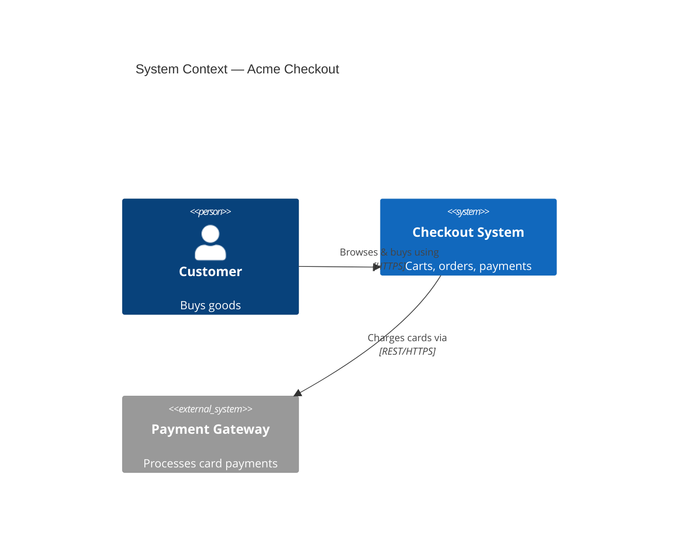

# C4 Model + Structurizr DSL

The C4 model (Simon Brown) describes **one software system** at four zoom levels. Think
Google Maps: zoom out for context, zoom in for detail. Most systems only ever need the
first two or three levels.

## Table of contents
1. The four levels
2. Core abstractions & naming
3. Choosing an output format
4. Structurizr DSL (the model-of-record format)
5. Mermaid C4 (inline rendering)
6. C4-PlantUML (toolchain rendering)
7. Diagram hygiene & common mistakes

## 1. The four levels

| Level | Name | Audience | Shows | Boxes are… |
|---|---|---|---|---|
| 1 | **System Context** | Everyone | Your system + its users + neighbouring systems | People, the system, external systems |
| 2 | **Container** | Technical staff | Apps, services, data stores *inside* your system | Deployable/runnable units (web app, API, DB, queue, SPA) |
| 3 | **Component** | Developers | Major building blocks inside one container | Components/modules with responsibilities |
| 4 | **Code** | Developers (rare) | Classes/interfaces of one component | Usually generated from code; often skip |

> A "container" in C4 means a **separately runnable/deployable thing** (a process, an app,
> a database) — NOT a Docker container. This trips everyone up. A Docker container *might*
> hold a C4 container, but they're different concepts.

**Stop at the level that answers the question.** Context + Container covers ~80% of needs.
Only produce Component when someone is going to build/modify that container. Code-level
diagrams are almost always noise — prefer the IDE.

## 2. Core abstractions & naming

- **Person** — a human user/role ("Customer", "Support Agent").
- **Software System** — the highest-level thing delivering value. Yours is "in scope";
  others are "external".
- **Container** — application or data store within your system.
- **Component** — grouping of related functionality within a container.
- **Relationship** — a directed, **labelled** dependency: *"Customer → Web App: places
  order using"*. Always label with intent + (optionally) technology/protocol.

Naming: short noun phrases for elements; verb phrases for relationships. Add a technology
tag in brackets/below: `[Spring Boot]`, `[PostgreSQL]`, `[HTTPS/JSON]`. Be consistent —
the same element keeps the same name in every view.

## 3. Choosing an output format

| Want… | Use | Why |
|---|---|---|
| A reusable **model** that generates many views, deployment diagrams, exports | **Structurizr DSL** | Define elements once, render many views; the EA "source of truth" |
| Something that **renders right now** in chat / GitHub / a Markdown doc | **Mermaid C4** | Native GitHub & many renderers; no toolchain |
| You already use **PlantUML / Kroki** | **C4-PlantUML** | Fits existing pipeline; rich styling |

Default to **Structurizr DSL** when persisting to a repo (it's the single-source-of-truth
play), **Mermaid** for quick/inline answers.

## 4. Structurizr DSL

One workspace defines the model once, then declares multiple views over it. This is the
canonical "diagrams as code" format for C4.

```
workspace "Acme Checkout" "Online checkout system" {

    model {
        customer = person "Customer" "A person buying goods"

        checkout = softwareSystem "Checkout System" "Handles carts, orders, payments" {
            web   = container "Web Application" "Server-rendered storefront" "Spring MVC"
            spa   = container "Single-Page App" "Cart & checkout UI" "React"
            api   = container "Checkout API" "Order & payment orchestration" "Spring Boot"
            db    = container "Database" "Orders, carts" "PostgreSQL" {
                tags "Database"
            }
            queue = container "Event Bus" "Async order events" "Kafka"

            spa  -> api "Makes calls to" "JSON/HTTPS"
            web  -> api "Makes calls to" "JSON/HTTPS"
            api  -> db  "Reads/writes" "JDBC"
            api  -> queue "Publishes order events to" "Kafka protocol"
        }

        payments = softwareSystem "Payment Gateway" "Processes card payments" {
            tags "External"
        }

        customer -> web "Browses & buys using" "HTTPS"
        customer -> spa "Browses & buys using" "HTTPS"
        api -> payments "Charges cards via" "REST/HTTPS"
    }

    views {
        systemContext checkout "Context" {
            include *
            autolayout lr
        }
        container checkout "Containers" {
            include *
            autolayout lr
        }
        # component view example (for one container):
        # component api "ApiComponents" { include * ; autolayout lr }

        styles {
            element "Person"   { shape person ; background #08427b ; color #ffffff }
            element "External" { background #999999 ; color #ffffff }
            element "Database" { shape cylinder }
        }
    }
}
```

Key DSL facts:
- `model { }` declares elements & relationships once; `views { }` declares what to show.
- Nesting elements inside `softwareSystem { }` / `container { }` sets containment.
- `include *` pulls in everything in scope for that view; you can include/exclude by name
  or tag for focused views.
- `autolayout lr|tb|bt|rl` lets Structurizr lay it out; or omit for manual layout in the
  Structurizr UI.
- `tags` drive styling and view filtering. `!docs` / `!adrs` can attach Markdown docs &
  ADRs to the workspace.
- A `deploymentEnvironment` block plus `deploymentNode`/`containerInstance` produces
  deployment diagrams from the same model.

Render with: Structurizr Lite (Docker, free), the Structurizr cloud, or export to PlantUML/
Mermaid/DOT via the CLI.

## 5. Mermaid C4 (inline)

Mermaid has native C4 support — good when you want it to render in GitHub/Markdown without
a toolchain. Syntax is less expressive than Structurizr but zero-setup.



Container level uses `C4Container` with `Container(...)`, `ContainerDb(...)`,
`Container_Boundary(alias,"label"){ ... }`. Component level uses `C4Component`.

> Mermaid C4 is still marked experimental and layout can be finicky; for anything you'll
> maintain long-term prefer Structurizr DSL and export.

## 6. C4-PlantUML

Uses the `C4-PlantUML` stdlib includes. Best when a PlantUML/Kroki pipeline already exists.

```plantuml
@startuml
!include https://raw.githubusercontent.com/plantuml-stdlib/C4-PlantUML/master/C4_Container.puml
title Container diagram — Acme Checkout
Person(customer, "Customer")
System_Boundary(c, "Checkout System") {
  Container(spa, "Single-Page App", "React", "Cart & checkout UI")
  Container(api, "Checkout API", "Spring Boot", "Order orchestration")
  ContainerDb(db, "Database", "PostgreSQL", "Orders, carts")
}
System_Ext(payments, "Payment Gateway", "Card processing")
Rel(customer, spa, "Uses", "HTTPS")
Rel(spa, api, "Calls", "JSON/HTTPS")
Rel(api, db, "Reads/writes", "JDBC")
Rel(api, payments, "Charges via", "REST/HTTPS")
@enduml
```

## 7. Diagram hygiene & common mistakes

- **5–20 elements per view.** More than ~20 means you're at the wrong altitude — split or
  zoom out.
- **Always show external systems and users.** A context diagram without the surrounding
  world is useless.
- **Label every relationship** with intent (and protocol where it matters). Unlabelled
  arrows are the #1 C4 smell.
- **Direction of arrows = direction of dependency/data**, stated from the caller's view.
- **One diagram = one level.** Don't mix containers and components in one picture.
- **Give every diagram a title and a legend/key** (notation isn't self-evident to readers).
- **Don't draw the Code level** unless asked — it rots instantly and the IDE does it better.
- **Reuse element IDs** across context/container/component views; the same API is the same
  API everywhere (ties into the skill's traceability scheme).
